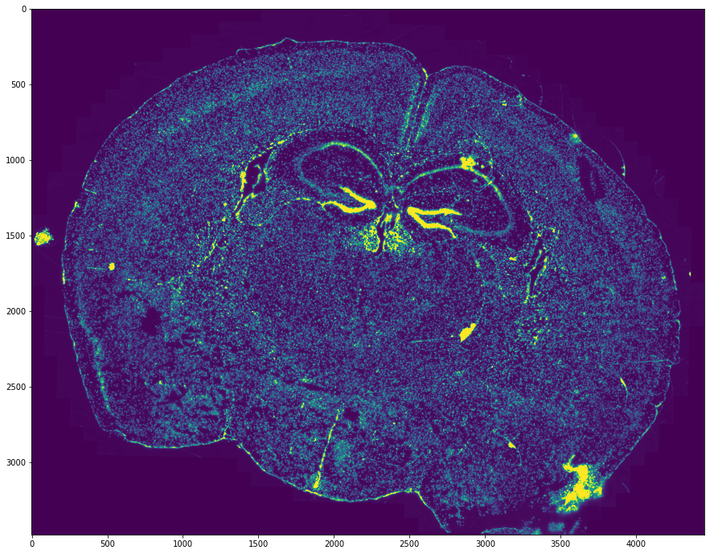
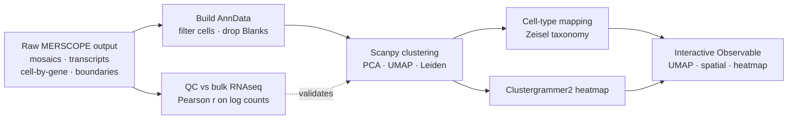
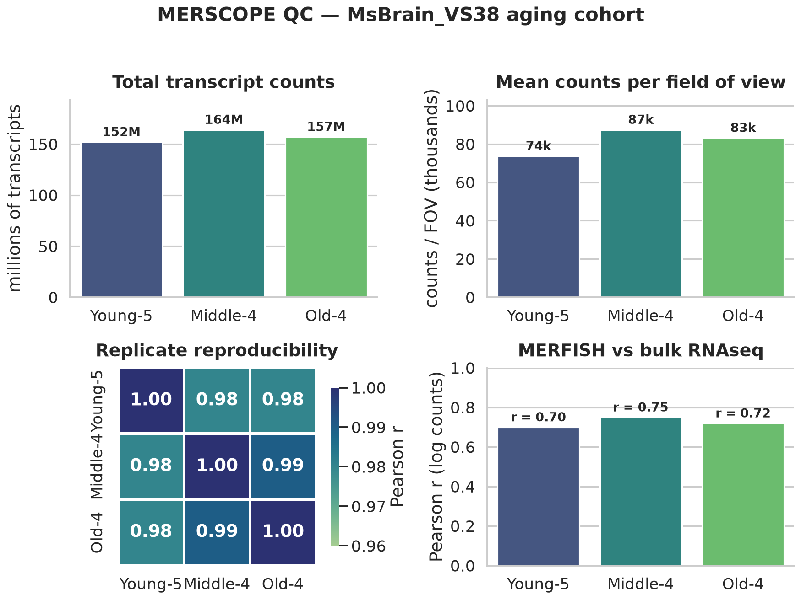
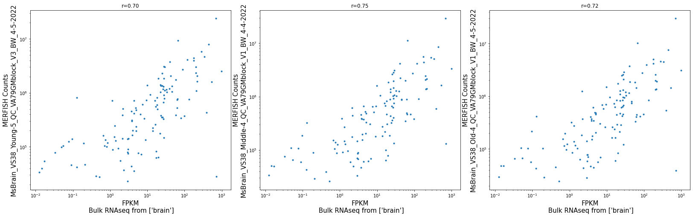
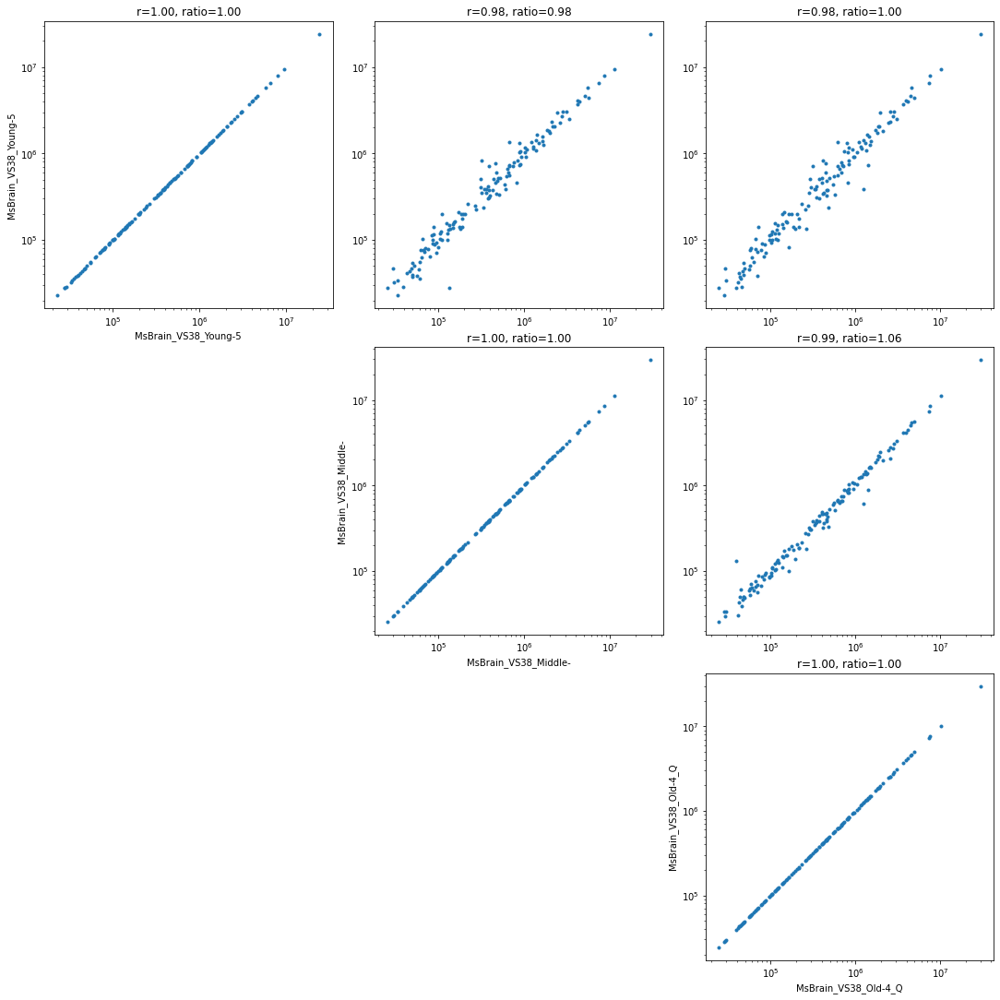
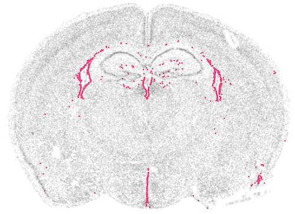
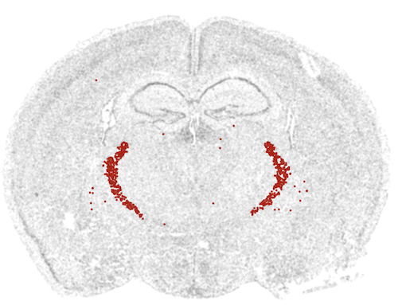
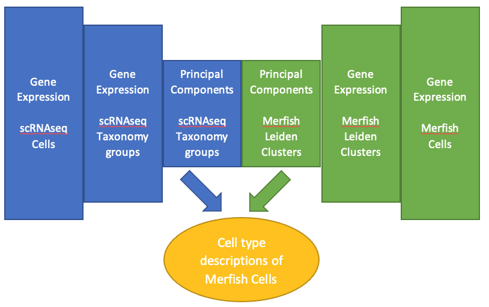
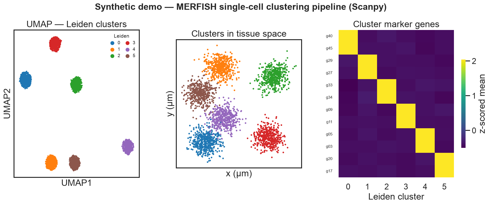

# 🧬 MERFISH Mouse Brain Atlas

> Single-cell-resolution spatial transcriptomics on the intact mouse brain — from raw Vizgen MERSCOPE output to interactive, cell-type-mapped spatial heatmaps.


**MERFISH** images individual RNA molecules *in situ* — reading out hundreds of genes per cell while keeping each transcript's exact position in intact tissue. This repo analyzes Vizgen **MERSCOPE** mouse-brain data end to end: load raw imagery + transcripts → QC against bulk RNAseq → **Scanpy** clustering (PCA / UMAP / Leiden) → cell-type mapping onto the Zeisel taxonomy → interactive **Observable** dashboards.



<p align="center"><em>A full coronal section reconstructed purely from spatial transcript positions — anatomy recovered from RNA alone.</em></p>

## 🔄 Pipeline



## 📊 QC results

Before any biological interpretation, [`qc_rnaseq_correlation.ipynb`](notebooks/pipeline/qc_rnaseq_correlation.ipynb) checks that MERFISH counts agree with an orthogonal assay and reproduce across the `MsBrain_VS38` aging cohort (Young / Middle / Old). Summary rendered with **seaborn** via [`scripts/qc_figures.py`](scripts/qc_figures.py).



- ✅ **Orthogonal validation** — per-gene MERFISH vs bulk RNAseq, Pearson **`r = 0.70–0.75`**.
- 🔁 **Reproducibility** — replicate-vs-replicate **`r = 0.98–1.00`**, count ratio ≈ 1.0.
- 📈 **Yield** — ~1.5–1.65 × 10⁸ transcripts per sample (~74k–87k / FOV).

<details>
<summary>Raw per-gene plots (original notebook outputs)</summary>

| MERFISH vs bulk RNAseq | Replicate correlation |
|---|---|
|  |  |

</details>

## 🧠 Cell types in space

After clustering, each Leiden cluster is matched to the [Zeisel et al.](http://mousebrain.org) mouse-brain scRNAseq taxonomy (cluster signatures → shared PCA space → cosine distance) and projected back onto the section — recovering where each cell type lives.

<p align="center">
  
  &nbsp;&nbsp;&nbsp;
  
</p>
<p align="center"><sub><b>Left:</b> cluster 22 — ependymal / glial cells (<i>Aqp4, Gfap, Mlc1</i>) lining the ventricles. &nbsp; <b>Right:</b> cluster 24 — inhibitory neurons (<i>Gad1, Slc32a1, Cckar</i>).</sub></p>

<details><summary>How clusters are mapped to cell types</summary>

<p align="center"></p>

</details>

## 📓 Notebooks

| Notebook | What it does |
|---|---|
| [`notebooks/showcase_mouse_brain.ipynb`](notebooks/showcase_mouse_brain.ipynb) | Canonical end-to-end Vizgen showcase (public GCS data): AnnData 83,546 × 483, Leiden + cell-type map, Observable dashboards |
| [`notebooks/broad_local_adaptation.ipynb`](notebooks/broad_local_adaptation.ipynb) | Local (non-Colab) adaptation reading MERSCOPE output from external SSDs |
| [`notebooks/transcript_viz_prototype.ipynb`](notebooks/transcript_viz_prototype.ipynb) | Minimal prototype: load output → render selected gene transcripts in Observable |
| [`notebooks/pipeline/qc_rnaseq_correlation.ipynb`](notebooks/pipeline/qc_rnaseq_correlation.ipynb) | MERFISH ↔ bulk RNAseq + replicate correlation QC (the plots above) |
| [`notebooks/pipeline/umap_spatial_heatmap_v0.3.1.ipynb`](notebooks/pipeline/umap_spatial_heatmap_v0.3.1.ipynb) | Single-cell viz compiler: S3 matrix → UMAP/Leiden → embedded dashboard |
| [`notebooks/pipeline/transcripts_genes_of_interest_v0.2.0.ipynb`](notebooks/pipeline/transcripts_genes_of_interest_v0.2.0.ipynb) | Lightweight transcript viewer for hand-picked genes of interest |

## 🗂️ Structure

```text
MERFISH/
├── notebooks/
│   ├── showcase_mouse_brain.ipynb        # canonical end-to-end showcase
│   ├── broad_local_adaptation.ipynb      # local adaptation (external SSDs)
│   ├── transcript_viz_prototype.ipynb    # transcript-viz prototype
│   ├── demo_synthetic_pipeline.ipynb     # ▶ runnable demo (no data needed)
│   └── pipeline/                         # modular, versioned stages
│       ├── qc_rnaseq_correlation.ipynb
│       ├── umap_spatial_heatmap_v0.3.1.ipynb
│       └── transcripts_genes_of_interest_v0.2.0.ipynb
├── scripts/
│   ├── qc_figures.py                     # seaborn QC summary figure
│   └── demo_pipeline.py                  # runnable synthetic pipeline demo
└── assets/                               # hero map · QC · cell-type · demo figures
```

## 🚀 Quick start

```bash
pip install scanpy leidenalg loompy clustergrammer2 observable_jupyter \
            tifffile opencv-python h5py matplotlib seaborn pandas numpy scipy scikit-learn fsspec gcsfs
jupyter lab        # open notebooks/showcase_mouse_brain.ipynb
```

Demo data (Vizgen public release): `gs://public-datasets-vizgen-merfish/datasets/mouse_brain_map/BrainReceptorShowcase/`. Point each notebook's `base_path` / `dataset_path` at your local copy or bucket — raw MERSCOPE output (`*.tif`, `*.hdf5`, large `*.csv`) is git-ignored. The QC notebook also needs Vizgen's proprietary `merlin` / `encoder.abundance` packages.

## 🧪 Run it locally (no data needed)

The production notebooks read private Vizgen S3/GCS data, so [`notebooks/demo_synthetic_pipeline.ipynb`](notebooks/demo_synthetic_pipeline.ipynb) (and [`scripts/demo_pipeline.py`](scripts/demo_pipeline.py)) run the **same Scanpy pipeline** on a small synthetic spatial dataset — proving the flow end to end and producing real, computed figures.

```bash
pip install scanpy leidenalg igraph seaborn
python scripts/demo_pipeline.py      # -> assets/demo_pipeline.png
```



<sub>Leiden recovers all 6 simulated cell-type domains — separated in UMAP, contiguous in tissue space, with a clean block-diagonal marker signature. <em>Data is synthetic; the pipeline and plots are real.</em></sub>

## 🙏 Credits

Built on [Vizgen MERSCOPE](https://vizgen.com), the [Zeisel et al.](http://mousebrain.org) scRNAseq taxonomy, [Scanpy](https://scanpy.readthedocs.io), [Clustergrammer2](https://clustergrammer.readthedocs.io), and Observable. Released under the **MIT License**.
