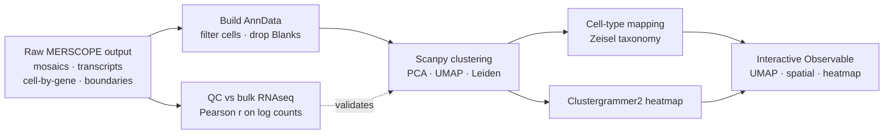
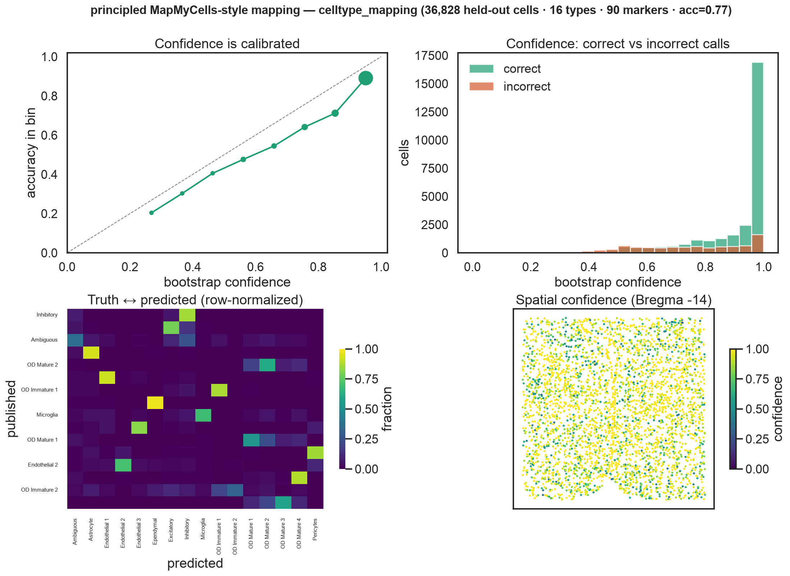
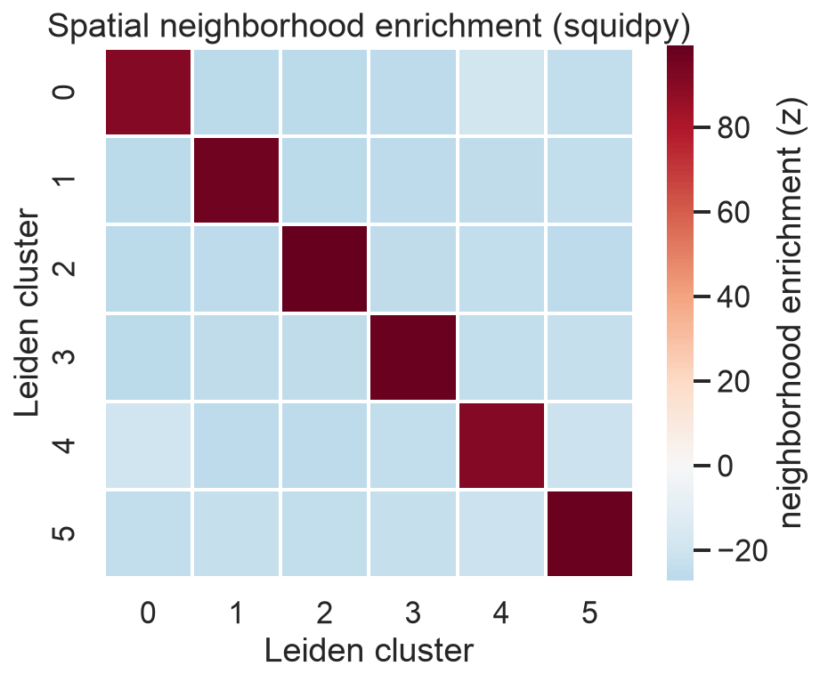
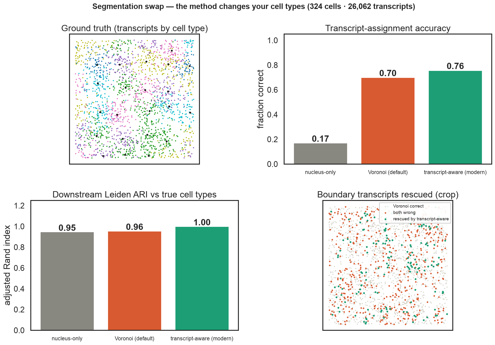
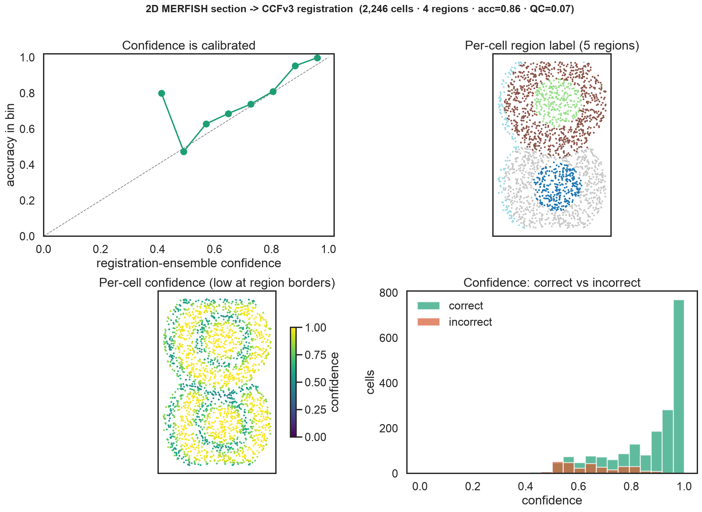
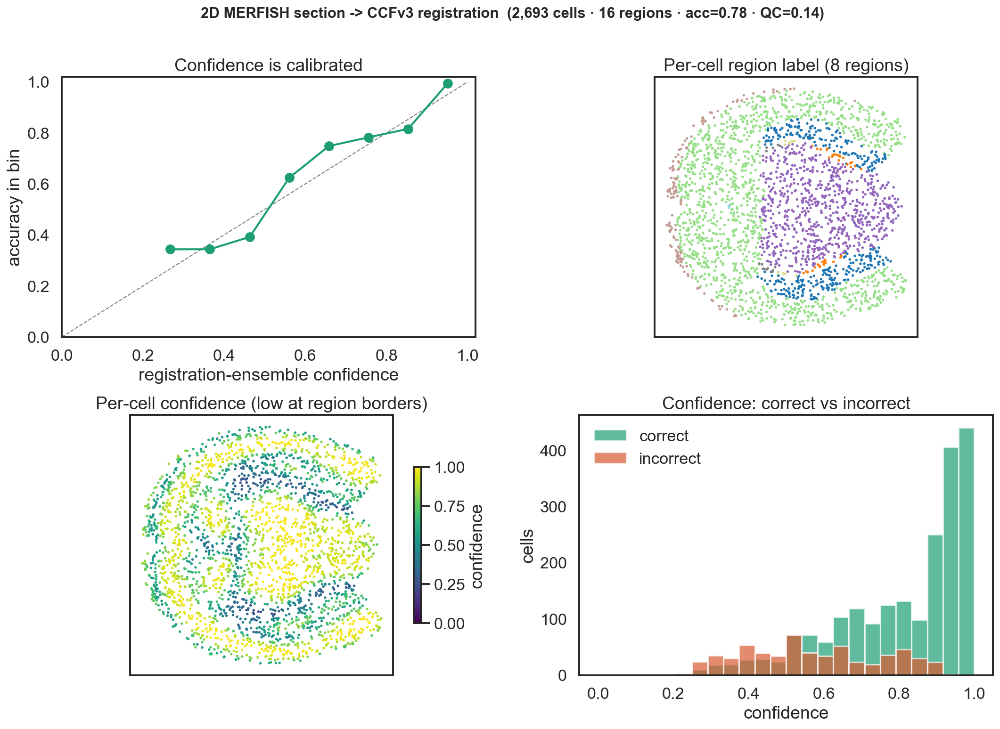
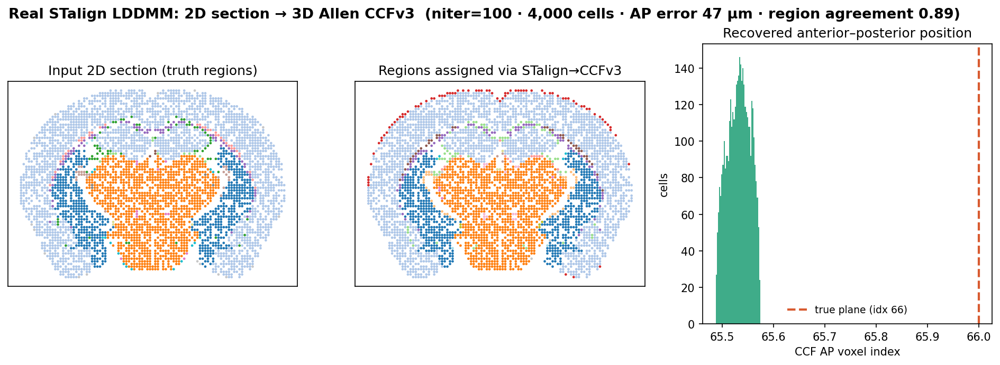
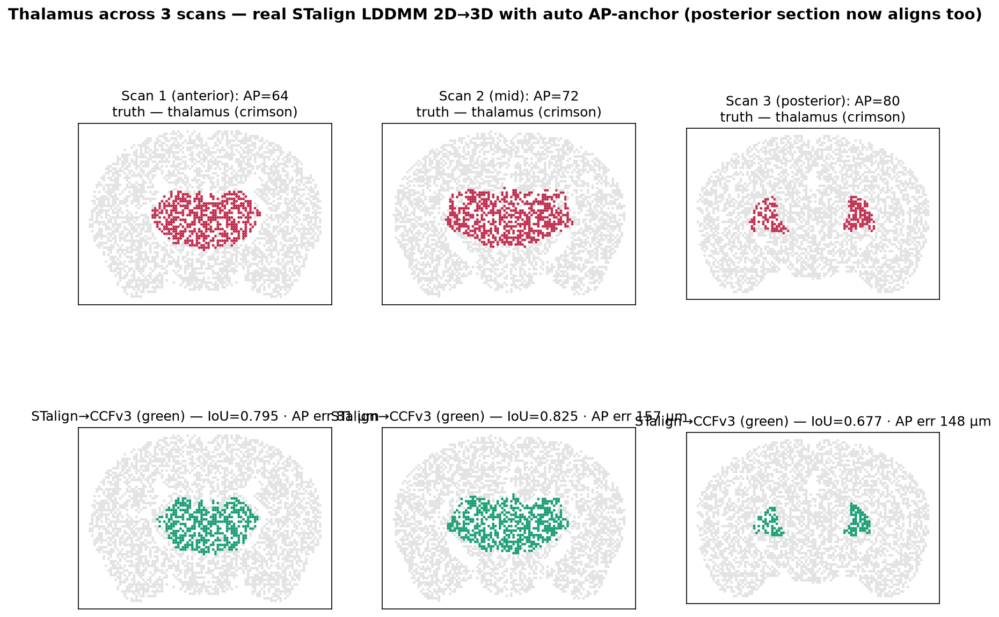
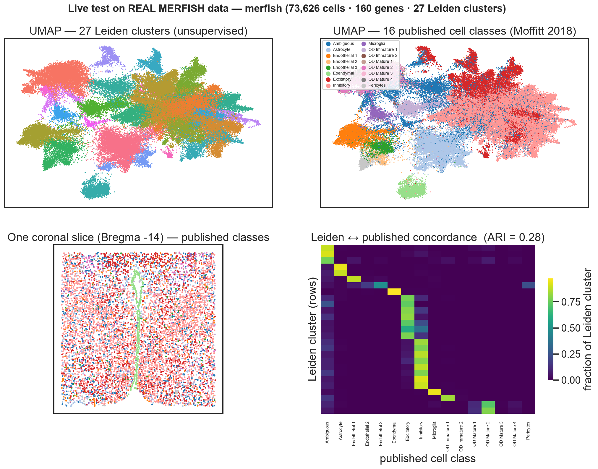

# 🧬 MERFISH Mouse Brain Atlas

> Single-cell-resolution spatial transcriptomics on the intact mouse brain — from raw Vizgen MERSCOPE output to interactive, cell-type-mapped spatial heatmaps.


**MERFISH** images individual RNA molecules *in situ* — reading out hundreds of genes per cell while keeping each transcript's exact position in intact tissue. This repo analyzes Vizgen **MERSCOPE** mouse-brain data end to end: load raw imagery + transcripts → QC against bulk RNAseq → **Scanpy** clustering (PCA / UMAP / Leiden) → cell-type mapping onto the Zeisel taxonomy → interactive **Observable** dashboards.

> **Implementation status:** the Scanpy pipeline, principled cell-type mapper, segmentation
> benchmark, and atlas-registration **core** (geometry + label transfer + calibrated UQ + QC) are
> implemented and covered by offline pytest. The real **CCFv3** (brainglobe) and the **STalign**
> LDDMM deformable backend are implemented and validated in an isolated env (live tests). Remaining
> backends that need large downloads — Allen `cell_type_mapper`, DeepSlice, ANTs — are **stubbed**
> with install hints. See [`docs/methods-review-2026.md`](docs/methods-review-2026.md).


<p align="center"><em>A full coronal section reconstructed purely from spatial transcript positions — anatomy recovered from RNA alone.</em></p>

## 🔄 Pipeline



## 📊 QC results

Before any biological interpretation, [`qc_rnaseq_correlation.ipynb`](notebooks/pipeline/qc_rnaseq_correlation.ipynb) checks that MERFISH counts agree with an orthogonal assay and reproduce across the `MsBrain_VS38` aging cohort (Young / Middle / Old). Summary rendered with **seaborn** via [`scripts/qc_figures.py`](scripts/qc_figures.py).


- ✅ **Orthogonal validation** — per-gene MERFISH vs bulk RNAseq, Pearson **`r = 0.70–0.75`**.
- 🔁 **Reproducibility** — replicate-vs-replicate **`r = 0.98–1.00`**, count ratio ≈ 1.0.
- 📈 **Yield** — ~1.5–1.65 × 10⁸ transcripts per sample (~74k–87k / FOV).

<details>
<summary>Raw per-gene plots (original notebook outputs)</summary>

| MERFISH vs bulk RNAseq | Replicate correlation |
|---|---|
|  |  |

</details>

## 🧠 Cell types in space

After clustering, each Leiden cluster is matched to the [Zeisel et al.](http://mousebrain.org) mouse-brain scRNAseq taxonomy (cluster signatures → shared PCA space → cosine distance) and projected back onto the section — recovering where each cell type lives.

<p align="center">
  
  &nbsp;&nbsp;&nbsp;
  
</p>
<p align="center"><sub><b>Left:</b> cluster 22 — ependymal / glial cells (<i>Aqp4, Gfap, Mlc1</i>) lining the ventricles. &nbsp; <b>Right:</b> cluster 24 — inhibitory neurons (<i>Gad1, Slc32a1, Cckar</i>).</sub></p>

<details><summary>How clusters are mapped to cell types</summary>

<p align="center"></p>

</details>

## 🎯 Principled cell-type mapping

The mapping above is a heuristic — shared-PCA + cosine to the Zeisel taxonomy. [`scripts/celltype_mapping.py`](scripts/celltype_mapping.py) implements the **MapMyCells / Allen `cell_type_mapper` algorithm** — marker-gene correlation with **bootstrap confidence** — and validates it on a held-out split of the real Moffitt data.

- 📈 **More accurate** — recovers the published `Cell_class` at **`0.77`** vs **`0.71`** for the cosine heuristic (held-out, 36,828 cells).
- 🎚️ **Confidence-scored** — every call gets a calibrated bootstrap confidence (mean **`0.87`**); confident calls are measurably more accurate, where the cosine method gives no confidence at all.
- 🪜 **Hierarchical** — coarse class, then refine to fine neuron subtype (`Cell_class` → `Neuron_cluster_ID`): **`0.82`** subtype accuracy within correctly-called classes.



<sub>Held-out validation on real Moffitt 2018 hypothalamus MERFISH. <b>Top-left:</b> accuracy rises with confidence (calibrated). <b>Top-right:</b> correct calls concentrate at high confidence, errors at low. <b>Bottom-left:</b> truth ↔ predicted concordance. <b>Bottom-right:</b> a coronal slice colored by confidence — flags where the 161-gene panel can't resolve a type. The genuine <code>cell_type_mapper</code> against the <a href="https://alleninstitute.github.io/abc_atlas_access/">ABC Atlas</a> whole-mouse-brain taxonomy is the documented next step.</sub>

```bash
python scripts/celltype_mapping.py --fig --hierarchical   # real data + figure
```

## 📓 Notebooks

| Notebook | What it does |
|---|---|
| [`notebooks/showcase_mouse_brain.ipynb`](notebooks/showcase_mouse_brain.ipynb) | Canonical end-to-end Vizgen showcase (public GCS data): AnnData 83,546 × 483, Leiden + cell-type map, Observable dashboards |
| [`notebooks/broad_local_adaptation.ipynb`](notebooks/broad_local_adaptation.ipynb) | Local (non-Colab) adaptation reading MERSCOPE output from external SSDs |
| [`notebooks/transcript_viz_prototype.ipynb`](notebooks/transcript_viz_prototype.ipynb) | Minimal prototype: load output → render selected gene transcripts in Observable |
| [`notebooks/pipeline/qc_rnaseq_correlation.ipynb`](notebooks/pipeline/qc_rnaseq_correlation.ipynb) | MERFISH ↔ bulk RNAseq + replicate correlation QC (the plots above) |
| [`notebooks/pipeline/umap_spatial_heatmap_v0.3.1.ipynb`](notebooks/pipeline/umap_spatial_heatmap_v0.3.1.ipynb) | Single-cell viz compiler: S3 matrix → UMAP/Leiden → embedded dashboard |
| [`notebooks/pipeline/transcripts_genes_of_interest_v0.2.0.ipynb`](notebooks/pipeline/transcripts_genes_of_interest_v0.2.0.ipynb) | Lightweight transcript viewer for hand-picked genes of interest |

## 🗂️ Structure

```text
MERFISH/
├── notebooks/
│   ├── showcase_mouse_brain.ipynb        # canonical end-to-end showcase
│   ├── broad_local_adaptation.ipynb      # local adaptation (external SSDs)
│   ├── transcript_viz_prototype.ipynb    # transcript-viz prototype
│   ├── demo_synthetic_pipeline.ipynb     # ▶ runnable demo (no data needed)
│   └── pipeline/                         # modular, versioned stages
│       ├── qc_rnaseq_correlation.ipynb
│       ├── umap_spatial_heatmap_v0.3.1.ipynb
│       └── transcripts_genes_of_interest_v0.2.0.ipynb
├── scripts/
│   ├── qc_figures.py                     # seaborn QC summary figure
│   ├── demo_pipeline.py                  # runnable synthetic pipeline demo
│   ├── celltype_mapping.py               # principled MapMyCells-style cell-type mapping
│   ├── segmentation_demo.py              # transcript-aware segmentation swap
│   ├── atlas_registration.py             # 2D section → CCFv3 + per-cell region labels
│   ├── stalign_demo.py                   # real STalign LDDMM 2D→3D fit on the CCFv3
│   └── live_test.py                      # pipeline on REAL public MERFISH data
├── tests/
│   ├── test_pipeline.py                  # pytest: synthetic + live real-data
│   ├── test_mapping.py                   # pytest: principled mapping + calibration
│   ├── test_segmentation.py              # pytest: segmentation changes clustering
│   └── test_atlas_registration.py        # pytest: registration geometry + calibration + QC
├── docs/
│   ├── methods-review-2026.md            # cell-type / segmentation / registration upgrades
│   └── atlas-registration-2026.md        # 2D section → CCFv3 registration review (cited)
├── requirements-dev.txt                  # unified dev env (Python 3.12+, numpy 2.x, STalign)
├── LICENSE
├── .github/workflows/test.yml            # offline pytest on push/PR (Python 3.12)
├── pytest.ini
└── assets/                               # hero · QC · cell-type · mapping · demo · live
```

## 🚀 Quick start

**Dev env** (notebooks + offline + live pytest + STalign — Python **3.12+**, numpy **2.x**):

```bash
uv venv --python 3.12 .venv && source .venv/bin/activate
uv pip install -r requirements-dev.txt
uv pip install --no-deps "STalign @ git+https://github.com/JEFworks-Lab/STalign.git"
# notebook extras (not in requirements-dev.txt):
uv pip install loompy clustergrammer2 observable_jupyter \
            tifffile opencv-python fsspec gcsfs jupyterlab
jupyter lab        # open notebooks/broad_local_adaptation.ipynb
```

> **STalign note:** upstream still lists `numpy==1.23.4` in its `requirements.txt`, but the code
> runs on numpy **2.4** with Python **3.12** when installed with `--no-deps`. Use **`np2typing`**
> (not plain `nptyping`) — already pinned in `requirements-dev.txt` — for numpy-2-compatible type
> hints that `pynrrd` imports at runtime.

**Other optional extras** (install when needed):

| Extra | Install | Used for |
|---|---|---|
| DeepSlice anchoring | `pip install DeepSlice` | `deepslice_anchor()` (stubbed) |
| Allen MapMyCells | `pip install cell-type-mapper` + WMB reference | `map_with_cell_type_mapper()` (stubbed) |

Demo data (Vizgen public release): `gs://public-datasets-vizgen-merfish/datasets/mouse_brain_map/BrainReceptorShowcase/`. Point each notebook's `base_path` / `dataset_path` at your local copy or bucket — raw MERSCOPE output (`*.tif`, `*.hdf5`, large `*.csv`) is git-ignored. The QC notebook also needs Vizgen's proprietary `merlin` / `encoder.abundance` packages.

## 🧪 Run it locally (no data needed)

The production notebooks read private Vizgen S3/GCS data, so [`notebooks/demo_synthetic_pipeline.ipynb`](notebooks/demo_synthetic_pipeline.ipynb) (and [`scripts/demo_pipeline.py`](scripts/demo_pipeline.py)) run the **same Scanpy pipeline** on a small synthetic spatial dataset — then a **squidpy** spatial-neighborhood analysis — proving the flow end to end with real, computed figures.

```bash
pip install scanpy squidpy leidenalg igraph seaborn
python scripts/demo_pipeline.py      # -> assets/demo_pipeline.png  +  assets/demo_spatial_squidpy.png
```


<sub>Leiden recovers all 6 simulated cell-type domains — separated in UMAP, contiguous in tissue space, with a clean block-diagonal marker signature.</sub>

<p align="center"></p>

<sub><b>squidpy</b> neighborhood enrichment on the same cells — strong positive self-enrichment (diagonal), depleted off-diagonal — the spatial question MERFISH coordinates uniquely let you ask. <em>Data is synthetic; the pipeline and plots are real.</em></sub>

## 🔬 Segmentation matters

Cell segmentation sits *upstream* of the whole pipeline — it builds the cell-by-gene matrix that PCA/UMAP/Leiden and cell-type mapping consume — and the 2025 [*Segmentation Matters*](https://www.biorxiv.org/content/10.1101/2025.08.25.672145v1) benchmark showed the method you pick measurably splits, merges, or drops downstream clusters. The production-ready, MERSCOPE-native tools are **proseg** (`proseg --merscope`), **Cellpose-SAM**, **RNA2seg**, and **segger**.

[`scripts/segmentation_demo.py`](scripts/segmentation_demo.py) makes the case end to end on simulated molecule-level data with known ground truth — comparing the vendor-default-style baseline against the modern **transcript-aware** paradigm (Baysor/proseg/segger-style: assign each molecule by position *and* expression likelihood):

| Segmentation | Transcript-assignment acc. | Downstream Leiden ARI |
|---|---|---|
| nucleus-only | 0.17 | 0.95 |
| Voronoi / expansion (vendor-default-style) | 0.70 | 0.96 |
| **transcript-aware (modern)** | **0.76** | **1.00** |



<sub>Transcript-aware segmentation rescues boundary molecules the Voronoi baseline misassigns (green, bottom-right) and recovers the true cell types perfectly downstream. <em>Data is simulated; the segmentation methods, pipeline, and metrics are real.</em> A guarded <code>cellpose_sam_segment()</code> hook runs the genuine Cellpose-SAM on real DAPI mosaics when <code>cellpose>=4</code> is installed.</sub>

```bash
python scripts/segmentation_demo.py --fig
```

## 🗺️ Aligning a new scan to the Allen CCFv3

The hardest part of a *new* section is **placing it in a common anatomical frame** — "which
brain region is each cell in?" That is 2D-section → 3D-atlas registration.
[`scripts/atlas_registration.py`](scripts/atlas_registration.py) implements the
**backend-agnostic core** of the recommended pipeline — *DeepSlice affine anchor → STalign /
ANTs deformable warp → per-cell annotation lift-over* — plus two things the surveyed tools
leave out: **calibrated per-cell uncertainty** and a **QC cross-check**. Validated end to end
on the **real Allen CCFv3** (loaded via `brainglobe-atlasapi`, NumPy-2 safe).

- 🧭 **Oblique cut angles, natively** — the DeepSlice `O/U/V` anchoring represents an
  obliquely-cut plane *exactly*, not approximated.
- 🎚️ **Calibrated per-cell confidence** — a *registration ensemble* (perturb the fit within its
  anchoring error, re-look-up, report the agreement fraction) gives each cell a confidence that
  is measurably calibrated: on the real CCFv3, **high-confidence calls are ~98–99% accurate at
  every ontology granularity** — so you pick the operating point (coarse for coverage, fine and
  trust only confident cells). Same bootstrap idea as the cell-type mapper.
- 🌳 **Hierarchical labels** — a single section can't resolve 670 CCF leaf regions; labels roll
  up the ontology tree (`--depth`) to ~20–50 major structures for robust per-cell calls.
- 🔬 **QC by orthogonal validation** — each region's cell-type composition vs the Allen ABC
  reference (Jensen-Shannon); a section with implausible regions is flagged (QC `0.14 → 0.96`
  under deliberate misregistration on the real CCFv3).

> **Honest scope:** the calibration/QC figures above use a synthetic anchoring error on real CCF
> geometry (ground truth known). The **STalign** deformable backend is now **implemented and
> validated with a real LDDMM fit** (below); **DeepSlice** and **ANTs** remain stubbed with install
> hints — see [`docs/atlas-registration-2026.md`](docs/atlas-registration-2026.md) § Implementation status.

<p align="center">
  
  
</p>

<sub><b>Left:</b> synthetic labelled atlas (offline pytest). <b>Right:</b> the same pipeline on
the <b>real Allen CCFv3</b> (depth-3, 16 regions in-section). Both: accuracy rises with ensemble
confidence (calibrated), labels recover the coronal structure, confidence is low at region
borders, correct calls concentrate at high confidence. The real engines (DeepSlice / STalign /
ANTs) wire in behind the same interface — see [the cited review](docs/atlas-registration-2026.md).</sub>

```bash
python scripts/atlas_registration.py --fig                   # synthetic demo (no data needed)
python scripts/atlas_registration.py --real --fig --depth 3  # real Allen CCFv3 (needs brainglobe-atlasapi)
```

**Real STalign LDDMM — the deformable engine, validated on the CCFv3.** Registering a 2D coronal
section to the 3D atlas with `STalign.LDDMM_3D_to_slice`, then lifting region labels onto every
cell. The section is cut from a *known* CCF plane, so the answer is checkable: STalign recovers its
anterior–posterior position to **47 µm (< 0.5 voxel)** and matches **0.89** of per-cell region
labels (depth-3), in ~2 min on CPU — real diffeomorphic 2D→3D alignment, not a stub.



<sub>Left → right: the input 2D section (true regions); the regions STalign assigns after warping it
into the CCFv3 (near-identical); the recovered AP position peaking at the true plane. Generated by
[`scripts/stalign_demo.py`](scripts/stalign_demo.py) in the unified dev env.</sub>

```bash
python scripts/stalign_demo.py --niter 100     # real STalign LDDMM fit (torch + STalign)
```

### Worked example: the thalamus across multiple scans (auto AP-anchor)

Three *different* coronal sections through the **thalamus** (`TH` + its 66 sub-nuclei) — anterior,
mid, posterior — each registered to the CCFv3 with real STalign, then *"which cells are thalamus?"*
scored against ground truth. STalign's raw 2D→3D fit is **init-sensitive** — the posterior section
misconverged (AP error **1.44 mm**, IoU 0.23). The fix: `coarse_ap_search` (a training-free stand-in
for DeepSlice's anchor) slides the section against every CCF coronal plane and hands STalign the
right starting AP via `stalign_register(init="auto")`.

| thalamus scan | bare STalign | **+ auto AP-anchor** |
|---|---|---|
| posterior (AP 80) — AP error | 1440 µm | **148 µm** (~10× better) |
| posterior (AP 80) — thalamus IoU | 0.23 | **0.68** |
| all 3 scans | 1 / 3 aligned | **3 / 3 aligned** (AP err ≤157 µm, IoU 0.68–0.83) |



<sub>Top: truth thalamus (crimson) in anterior / mid / posterior scans. Bottom: recovered by real
STalign→CCFv3 (green) — including the posterior bilateral clusters the bare fit missed.
[`scripts/thalamus_stalign_demo.py`](scripts/thalamus_stalign_demo.py); the anchor is unit-tested
and the posterior recovery live-tested in [`tests/test_atlas_init.py`](tests/test_atlas_init.py).</sub>

```bash
python scripts/thalamus_stalign_demo.py        # 3 thalamus scans, STalign + auto-anchor
```

## ✅ Tested on real data

The pipeline isn't only demoed — it's **validated by a `pytest` suite**, including a *live* test that downloads a real MERFISH dataset ([Moffitt et al. 2018](https://www.science.org/doi/10.1126/science.aau5324), mouse hypothalamic preoptic region — 73,626 cells × 160 genes, via `squidpy.datasets`) and checks that unsupervised Leiden clustering **recovers the authors' published cell types**.



<sub>Unsupervised Leiden (27 clusters) vs the 16 published cell classes: concordant UMAP structure, real anatomy in a single coronal slice (third ventricle visible), and a near-diagonal concordance heatmap — <b>Adjusted Rand Index = 0.28</b> vs ~0 for random labels. Generated live by <a href="scripts/live_test.py"><code>scripts/live_test.py</code></a>.</sub>

```bash
uv pip install -r requirements-dev.txt
uv pip install --no-deps "STalign @ git+https://github.com/JEFworks-Lab/STalign.git"
pytest -m "not live"      # 21 offline (synthetic) — no network needed
pytest -m live            # 5 live (MERFISH + CCFv3 + STalign) — needs network
```

## 🌐 Spatial transcriptomics in context

MERFISH — the chemistry behind Vizgen's MERSCOPE and the basis for this repo's data — is one of three dominant **imaging-based, subcellular-resolution** spatial transcriptomics platforms, alongside 10x Genomics **Xenium** (padlock-probe ISH) and Bruker/NanoString **CosMx** (cyclic FISH). Imaging methods give single-molecule localization on *targeted* panels; sequencing-based methods (Visium HD, Stereo-seq, Slide-seqV2) trade spatial precision for *unbiased whole-transcriptome* coverage. This repo's mouse-brain data used a targeted panel on the original MERSCOPE — the pre-2024 product generation.

| Platform | Chemistry | Max panel (commercial) | Resolution | Notable 2024–25 updates |
|---|---|---|---|---|
| **Vizgen MERSCOPE Ultra** | MERFISH (iterative smFISH barcoding) | ~1,000 genes; no whole-transcriptome product | 100 nm pixel (subcellular) | MERSCOPE Ultra + MERFISH 2.0 (AACR 2024); Vizgen–Ultivue merger (Oct 2024) |
| **10x Xenium (Prime 5K)** | Padlock-probe ligation + RCA, cyclic imaging | ~5,000 genes (5,006 pre-designed) + 100 custom | XY <30 nm, Z <150 nm | Prime 5K shipping (Jun 2024); Xenium Protein co-detection |
| **Bruker/NanoString CosMx** | Cyclic FISH, no RT/PCR | 6,175-gene (6K) + WTX ~19,000 human genes | ≤100 nm FOV-scale (no published localization figure) | 6K panel (Feb 2024); WTX whole-transcriptome (summer 2025); CosMx 2.0 AI segmentation |

<details><summary>Sequencing-based platforms (whole-transcriptome, lower spatial precision)</summary>

| Platform | Method | Resolution | Coverage |
|---|---|---|---|
| **10x Visium HD** | Probe capture on 2 µm array + NGS | 2 µm bins (single-cell scale) | >18,000 genes |
| **Stereo-seq (STOmics)** | DNB-patterned array + NGS | 0.22 µm spot pitch (binned) | Whole transcriptome |
| **Slide-seqV2** | Barcoded bead array + NGS | ~10 µm beads | Near-whole transcriptome |

</details>

**Industry insights**
- **Toward whole-transcriptome imaging** — panels grew from hundreds to thousands of genes; CosMx now ships a ~19,000-gene WTX assay, Xenium offers ~5,000, while MERSCOPE stays targeted (~1,000 ceiling) as of mid-2026.
- **Standardization on scverse / SpatialData** — the field is converging on the AnnData/SpatialData substrate ([Marconato et al., *Nat Methods* 2024](https://doi.org/10.1038/s41592-024-02212-x)); `spatialdata-io` reads MERSCOPE, Xenium, and CosMx into one OME-NGFF Zarr store.
- **Segmentation is the active front** — transcript-aware (Baysor, proseg) and deep-learning (Cellpose-SAM) methods increasingly beat morphology-only segmentation in dense tissue; vendors now ship AI segmentation.
- **No single platform wins** — 2025 benchmarks ([Wang et al., *Nat Commun*](https://www.nature.com/articles/s41467-025-64990-y)) find imaging best for subcellular precision and validated cell-type calls, sequencing-HD best for unbiased discovery.

## 🗺️ Modern extensions

High-value additions to this scanpy Leiden/UMAP workflow, in roughly increasing scope:

- **Modern cell segmentation** — ✅ *demonstrated* in [`scripts/segmentation_demo.py`](scripts/segmentation_demo.py): transcript-aware segmentation (Baysor/proseg/segger-style) beats Voronoi on assignment (`0.76` vs `0.70`) and downstream ARI (`1.00` vs `0.96`). Production: `proseg --merscope` / Cellpose-SAM on raw MERSCOPE output.
- **Spatial statistics & niche enrichment** — `squidpy` for spatial neighbor graphs, neighborhood enrichment, and co-occurrence *(shown in the runnable demo above)*.
- **Spatial domain discovery** — `CellCharter` for batch-aware spatial niches across samples.
- **Spatially variable genes** — Moran's I (`squidpy.gr.spatial_autocorr`), `SpatialDE`, or `SPARK-X`; cross-validate, since no method is canonical.
- **Cell–cell communication** — `LIANA+` for spatially-resolved ligand–receptor inference on the cell-type map.
- **Principled reference mapping** — ✅ **core implemented** in [`scripts/celltype_mapping.py`](scripts/celltype_mapping.py): marker-correlation + bootstrap-confidence (beats cosine heuristic `0.77` vs `0.71`). Stub: genuine `cell_type_mapper` against ABC Atlas WMB taxonomy.
- **Atlas registration & per-cell region labels** — ✅ **core implemented** in [`scripts/atlas_registration.py`](scripts/atlas_registration.py): geometry, label transfer, calibrated UQ + QC on real CCFv3, plus the **STalign** deformable engine with an **auto AP-anchor** (`coarse_ap_search`). Stubbed: DeepSlice / ANTs engines — see [atlas-registration review](docs/atlas-registration-2026.md) (incl. limitations).
- **Atlas integration & interchange** — migrate to `SpatialData`/Zarr and map onto the BICCN / Allen Brain Cell Atlas whole-mouse-brain MERFISH taxonomies.

## 📖 References

- [Chen et al. (2015), *Science* — MERFISH founding paper](https://www.science.org/doi/10.1126/science.aaa6090)
- [Moffitt et al. (2018), *Science* — hypothalamus MERFISH](https://www.science.org/doi/10.1126/science.aau5324) (the real dataset used in the live test)
- [Zeisel et al. (2018), *Cell* — Molecular Architecture of the Mouse Nervous System](https://www.sciencedirect.com/science/article/pii/S009286741830789X) (the cell-type reference used here)
- [Zhang et al. (2023), *Nature* — whole mouse-brain MERFISH atlas](https://www.nature.com/articles/s41586-023-06808-9)
- [Yao et al. (2023), *Nature* — Allen Brain Cell Atlas of the whole mouse brain](https://www.nature.com/articles/s41586-023-06812-z)
- [Marconato et al. (2024), *Nat Methods* — SpatialData framework](https://doi.org/10.1038/s41592-024-02212-x)
- [Palla et al. (2022), *Nat Methods* — Squidpy](https://doi.org/10.1038/s41592-021-01358-2)
- [Kleshchevnikov et al. (2022), *Nat Biotechnol* — cell2location](https://doi.org/10.1038/s41587-021-01139-4)
- [Wang et al. (2025), *Nat Commun* — benchmarking imaging spatial platforms](https://www.nature.com/articles/s41467-025-64990-y)
- [Allen Institute — MapMyCells / `cell_type_mapper`](https://github.com/AllenInstitute/cell_type_mapper) (the principled mapping algorithm implemented in [`scripts/celltype_mapping.py`](scripts/celltype_mapping.py))
- [Carey et al. (2023), *Nat Commun* — DeepSlice](https://www.nature.com/articles/s41467-023-41645-4) (automated 2D section → CCF affine anchoring + cut-angle estimation)
- [Clifton et al. (2023), *Nat Commun* — STalign](https://www.nature.com/articles/s41467-023-43915-7) (LDDMM alignment of single-cell spatial data to the 3D CCF)
- [**Methods review (2026)**](docs/methods-review-2026.md) — principled upgrades for cell-type mapping, segmentation, and registration
- [**Atlas registration review (2026)**](docs/atlas-registration-2026.md) — 2D section → CCFv3 registration + per-cell region labels, with verified citations

## 🙏 Credits

Built on [Vizgen MERSCOPE](https://vizgen.com), the [Zeisel et al.](http://mousebrain.org) scRNAseq taxonomy, [Scanpy](https://scanpy.readthedocs.io), [Clustergrammer2](https://clustergrammer.readthedocs.io), and Observable. Released under the **MIT License**.
